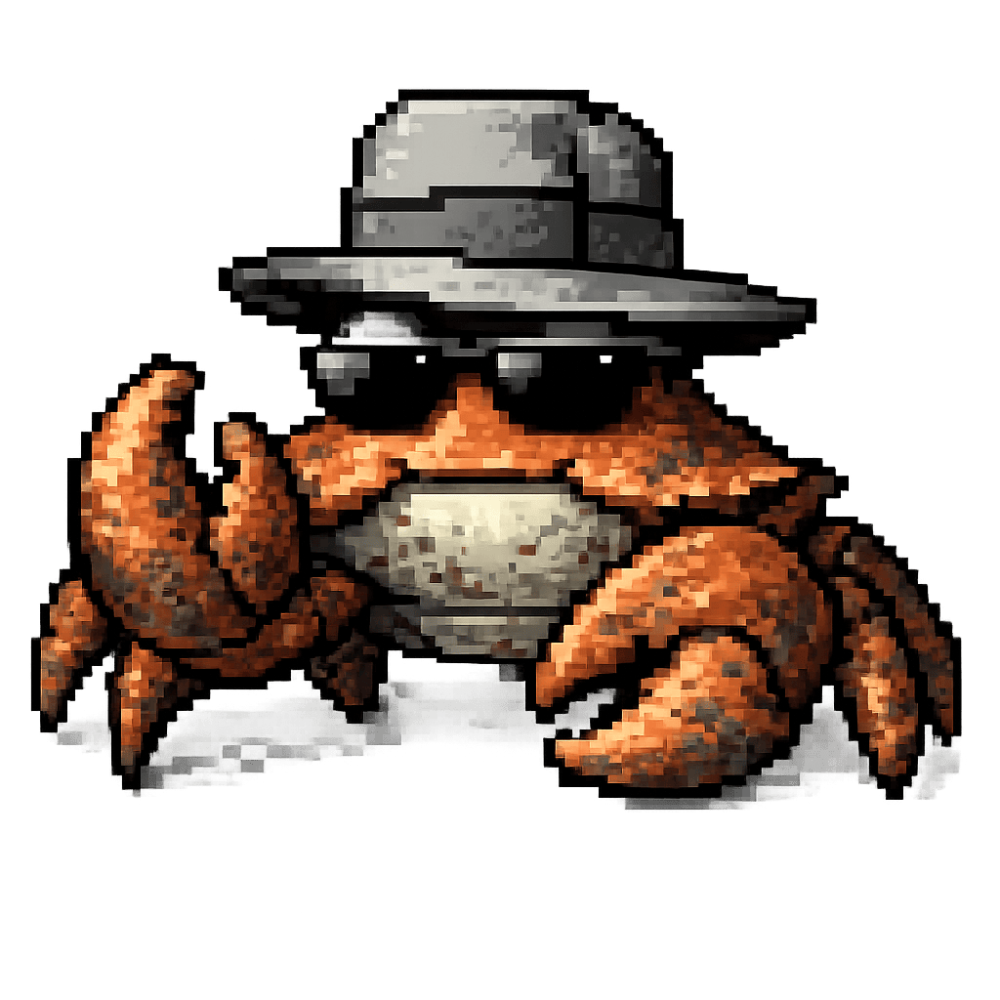

# crustagent

<p align="center">
  
</p>

Use classic **Microsoft Agent** characters — *Clippy, Merlin, Genie, Peedy, Robby* — in
modern, cross-platform apps, from safe **Rust**.

crustagent reads the original `.acs` character files (and, over time, `.acf`/`.acd`) and
gives you their palettes, animations, frames, sounds and speech markup as clean Rust
types — plus a portable runtime to sequence and play them. No Windows, no COM, no SAPI, no
DirectShow. The aim isn't to re-clone the old desktop assistant wholesale; it's to make
these lovingly-made characters usable again wherever Rust runs.

## Lineage

- **Microsoft Agent** (late-'90s/early-2000s) is the OG — the technology and the `.acs`
  format we target. Microsoft retired it after Windows Vista; the characters outlived it.
- **crustagent** is a from-scratch, platform-independent Rust take, aimed at modern apps
  rather than at reproducing every Windows detail. The file formats and playback rules were
  reverse-engineered from Microsoft's own runtime binaries and written up as
  [`docs/acs-format.md`](docs/acs-format.md) and [`docs/act-format.md`](docs/act-format.md);
  the parsers and sequencer are implemented from those specs.

## Workspace layout

```
crates/
  crustagent/          # embedding API: Agent + serial action queue (start here to embed)
  crustagent-format/   # pure parsers for the character file formats (ACS 2.0, ACS 1.5, ACF header, Actor/ACT)
  crustagent-core/     # portable runtime: sequencing, idle, motion, balloon layout, text
  crustagent-balloon/  # windowing-free balloon painter: BalloonView + BalloonStyle -> RGBA
  crustagent-tts/      # pluggable text-to-speech: VoiceEvent stream + TimedTts/SystemTts
  crustagent-audio/    # sound-effect playback (rodio) — the character's embedded WAVs
  crustagent-gif/      # dependency-free animated GIF89a encoder (round-trip tested)
  crustagent-render/   # viewer: tight character window + separate balloon window
```

The viewer uses two windows, MS-Agent-style: a **tight, non-resizable character window**
and a **separate balloon window** that appears above the character (or below, near the
screen top) while it speaks. Both are transparent, borderless, and always-on-top (`wgpu`).
The balloon pixels themselves are drawn by `crustagent-balloon` — a light,
windowing-free painter (`fontdue`/`fontdb`/`font8x8`, no winit/wgpu) that rasterizes a
`BalloonView` + `BalloonStyle` into an RGBA buffer, so a host can place the balloon in its
own surface without pulling in the viewer.

### Embed it

```rust
use crustagent::{Agent, Event};
let mut agent = Agent::load("Merlin.acs")?;
agent.show();
let hi = agent.speak("Hello there!");       // returns a ReqId you can track
agent.think("Now what should I do?");       // thought balloon, no audio
agent.play("Wave");
agent.move_to(400, 200, 300);
loop {
    agent.update(dt_ms);                       // advance by elapsed time
    for event in agent.drain_events() {        // lifecycle + bookmark + input events
        if event == Event::RequestCompleted(hi) { /* the greeting finished */ }
    }
    if let Some(frame) = agent.composite_current() { /* blit frame.pixels (RGBA) */ }
    if let Some(b) = agent.balloon() { /* draw b.layout.lines with agent.balloon_style() */ }
}
```

The `Agent` runs a serial action queue (`show`/`hide`/`play`/`play_looping`/`speak`/`think`/
`move_to`/`gesture_at`/`wait`), auto-idles when the queue drains, and hands back a composited
RGBA frame + balloon + position each tick — windowing- and audio-agnostic. `play` runs a
gesture once; **`play_looping`** holds it on a loop — sustaining a pose or gesture until
`stop()` or the next queued request preempts it. `move_to` walks or flies a character that
has `MOVING*` animations, and **teleports** one that doesn't (vanish → jump → reappear via
`HIDING`/`SHOWING`). Speech is normally serial (`speak`
drives the character's `SPEAKING` animation + mouth), but **`say_over`/`think_over`** show a
balloon that reveals *over the current animation* without taking a queue slot — so the
character can talk while it keeps gesturing. **`ask`** puts an *interactive* balloon up —
clickable choices, check boxes, a commit-button row, and optionally a **text field** —
modeled on the Office Assistant's balloon (Microsoft Agent's own was text-only); the host
hit-tests with `crustagent-balloon`'s `ask_hit_test` and reports back via `report_ask_hit`,
and the answer arrives as `Event::Answered`. The field (Office's search box, which its API
never actually exposed) is edited through `report_ask_text` / `report_ask_edit` and submits
with `report_ask_submit`, with selection (shift-arrows, drag, double-click-to-word) and
copy/cut/paste and undo/redo — the agent stays clipboard-free, handing the host
`ask_selected_text()` and taking pasted text back through `report_ask_text`. See [`docs/balloon-ui.md`](docs/balloon-ui.md). Every request
returns a `ReqId`, and `drain_events()` yields an `Event` stream (request start/complete,
show/hide, idle start/end, balloon show/hide, speech start/word/end, `\Mrk` **bookmarks**,
answers, plus host-reported clicks/drags) so an app can react to what the character is doing. Speech
supports **pause/resume**, and the word balloon honors the character's own styling
(`balloon_style()`: colors, lines × chars, size-to-text, auto-pace, auto-hide) with speak
(pointed tail) and think (bubble trail) shapes. Sound effects (the character's per-frame
embedded WAVs) fire through a pluggable `AudioSink` (`set_audio_sink`; `crustagent-audio`
provides a rodio backend).

Speech goes through a pluggable `TtsEngine` (`crustagent-tts`): the default `TimedTts` is
silent and paces the balloon/mouth on a timer, while `SystemTts` plays real audio on
Windows/macOS/Linux via the [`tts`](https://crates.io/crates/tts) crate (WinRT/SAPI,
AVSpeech, speech-dispatcher). Engines emit a `VoiceEvent` stream (word boundaries →
balloon reveal, visemes → mouth) that the `Agent` consumes each tick. (Linux needs
`speech-dispatcher` installed for audio; it degrades to silent otherwise.)

The character's original SAPI 4 voice no longer exists on any modern system, but its
*gender* and language survive in the file, so `set_tts` points the engine at a matching
system voice — a male character doesn't get the OS's (usually female) default. Characters
that don't state a gender have it inferred from the voice id they selected
(`Tts::resolved_gender`); `cargo run -p crustagent-tts --example voices -- assets/agents/ACS`
prints what each one will sound like.

Planned: a viseme-accurate/offline TTS backend (e.g. Piper) for true lip-sync, `.aca`
bodies for ACF, and a host-defined command API for the menu.

## `crustagent-format` — status

Implemented:
- **ACS 2.0** (`AcsFile`) — the compiled binary format: header, palette, TTS/balloon
  metadata, names (with language preference), states, gestures→animations→frames
  (images, overlays, branching), the LZ77 image bitstream **decompressor**, raw WAV
  sound extraction, and a **frame compositor** to RGBA/indexed.
- **ACS 1.5** — the older **OLE2 compound-document** format (a `char.acf` header stream +
  one compressed stream per animation), normalized into the same `AcsFile`.

  The `.acs` / `.acf` / `.aca` on-disk formats are documented in
  [`docs/acs-format.md`](docs/acs-format.md).
- **ACT** (`ActFile`) — the *Microsoft Actor* character table that preceded Agent (the
  Office 97/98 Assistants — Clippit, Rover, The Genius, Mother Nature, Will, Earl, Rocky,
  Bosgrove, Max, … — and Microsoft Bob), in both the little-endian PC and big-endian
  classic-Mac byte orders. **Fully supported** — every character decodes, renders, and
  animates. The container (identity, palette, embedded WAV sounds), the **object table**
  (index → image cel or composited pose), the **poses** (layered image parts), and the
  **named animations** (Idle, Greeting, Thinking, … by their Actor action ids, each with
  random variants and a frame program of show / weighted-branch / sound ops) all decode —
  the actual format the original engine uses, shared across every character variant.
  `ActFile::render_object` composites any object to a full RGBA character frame,
  `ActFile::action_sequence` runs an action's program like the ACS sequencer, and
  `ActFile::animate` returns an action's composited, timed frames.
  All three artwork encodings rasterize to full color:
  - **WMF** vector cels (Clippit, Rover, Will, …) — rendered from the metafile.
  - **`MNAK`** compressed bitmaps (The Genius, Mother Nature, Earl, Rocky) — LZ77
    (the ACS bitstream) → run-length-encoded 8bpp sub-images, colored with the Windows
    system palette.
  - **Apple QuickTime SMC** (`'smc '`) — the classic-Mac cels, an inter-frame video codec
    (a keyframe plus delta frames composited over it), colored with the Macintosh system
    palette. `animate` handles the inter-frame compositing.

  The complete on-disk format — container, all three artwork codecs, the object/pose/frame/
  action tables, palettes, and the Microsoft-binary references it was reversed from — is
  documented in [`docs/act-format.md`](docs/act-format.md).

Not yet (nice-to-have): ACF (+ external `.aca`), ACD (text script), and a small set of files
with an obfuscated/variant 2.0
char-info block. Run the `sweep` example to audit a character library against the parser.

## `crustagent-core` — status

Implemented:
- **Sequence builder** (`sequence_animation`) — flattens an animation's branching frame
  graph into a linear, timed `AnimationSequence`, with deterministic (injectable) branch
  RNG, loop detection, and runaway-loop guards; plus `sequence_exit` for return-to-neutral.
- **Player** — drives a sequence against a monotonic clock, handling looping and
  completion; ask it which frame is on screen at time *t*.
- **Character** — name/state → animation resolution (case-insensitive) over a parsed
  file, incl. the multi-part gesture convention (`full_gesture` chains a gesture's base +
  `…Continued` + `…Return` parts).
- **IdleDirector** — escalating auto-idle animation selection (`IDLINGLEVEL1→2→3`).
- **Speech-text parser** (`parse_speech`) — splits a `Speak` string into balloon display
  words and a neutral speech-directive stream (all 23 tags, `\Map` dual text, `\Mrk`
  bookmarks, `\\`/`\"` escaping).

The action queue, idle escalation, and move interpolation that drive these live one layer
up, in the `crustagent` (`Agent`) crate.

## Try it

Character files are third-party; drop your own into `assets/agents/` (see
`assets/README.md`). Then:

```sh
cargo test
cargo run -p crustagent-format --example dump     -- assets/agents/Merlin.acs
cargo run -p crustagent-format --example render   -- assets/agents/Merlin.acs Greet 0   # one frame -> PNG
cargo run -p crustagent-core   --example sequence -- assets/agents/Merlin.acs Greet     # print the timeline
cargo run -p crustagent-core   --example gif      -- assets/agents/Merlin.acs GetAttention  # gesture -> GIF
cargo run -p crustagent-format --example act_dump -- assets/agents/ACT/clippit.act Thinking t.png # Actor action -> PNG
cargo run -p crustagent-core   --example act_gif  -- assets/agents/ACT/clippit.act Greeting g.gif  # Actor action -> GIF

# See it on your desktop (transparent, always-on-top):
cargo run -p crustagent-render -- assets/agents/Merlin.acs                  # idles
cargo run -p crustagent-render -- assets/agents/Merlin.acs --tts            # ...and audible (cross-platform TTS)
cargo run -p crustagent-render -- assets/agents/Merlin.acs GetAttention     # loop a specific gesture
cargo run -p crustagent-render -- assets/agents/ACT/clippit.act             # Actor (.act): idles, MS-Agent-style
cargo run -p crustagent-render -- assets/agents/ACT/clippit.act Thinking    # ...play a named Actor action
```

With no animation named, the character **idles** — escalating `IDLINGLEVEL` animations,
like the assistant standing around. Name one to loop that gesture instead. **Drag** the
character with the left mouse button; **right-click** for a command menu; **Esc/Q** quits.
The menu's **Ask** items raise an *interactive* balloon — clickable choices, check boxes and
buttons, or a typed search question — the way the Office Assistant's balloon worked (see
[`docs/balloon-ui.md`](docs/balloon-ui.md)).

The window is a borderless, transparent, always-on-top `wgpu` surface (premultiplied
alpha) so the character floats on the desktop.

## Provenance & license

The `.acs` format and the character artwork belong to Microsoft and the original character
authors; **no character assets are included in this repository**. crustagent's byte-level
formats and playback rules were reverse-engineered from Microsoft's own runtime binaries and
sample character files, documented in [`docs/acs-format.md`](docs/acs-format.md) and
[`docs/act-format.md`](docs/act-format.md), and implemented from those documents. The
speech-markup parser is implemented from Microsoft's published `Speak()` tag documentation,
written up in [`docs/speak-markup.md`](docs/speak-markup.md), as are the interactive-balloon
and command-menu semantics in [`docs/balloon-ui.md`](docs/balloon-ui.md).

crustagent is licensed under either of **MIT** ([`LICENSE-MIT`](LICENSE-MIT)) or
**Apache-2.0** ([`LICENSE-APACHE`](LICENSE-APACHE)), at your option — so it can be used from
projects under any license. Contributions are accepted under the same dual license.
Third-party notices are in [`NOTICE`](NOTICE).
